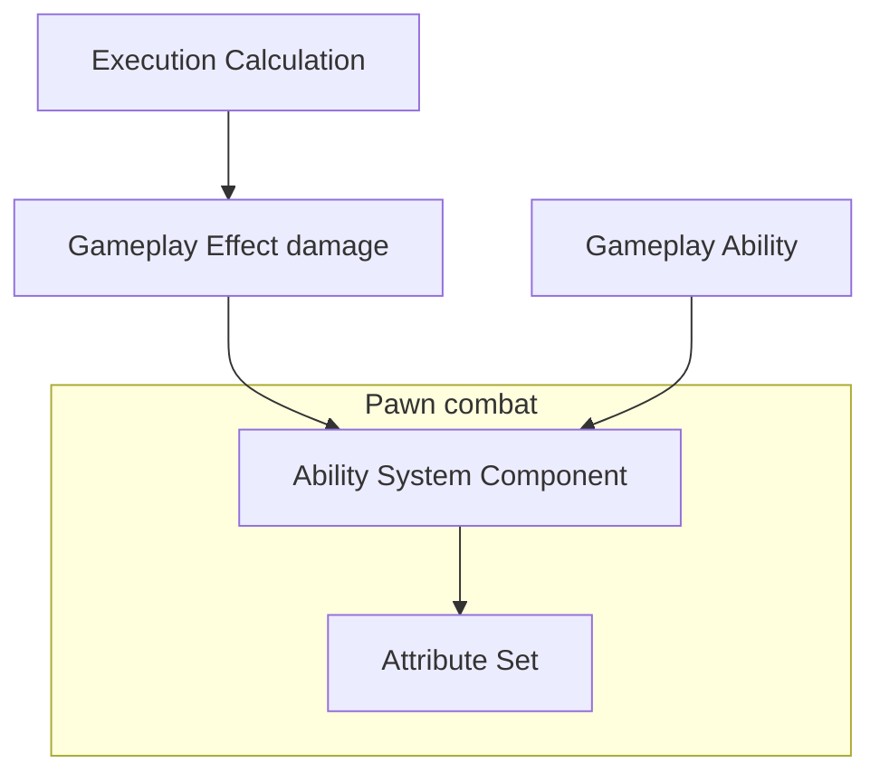
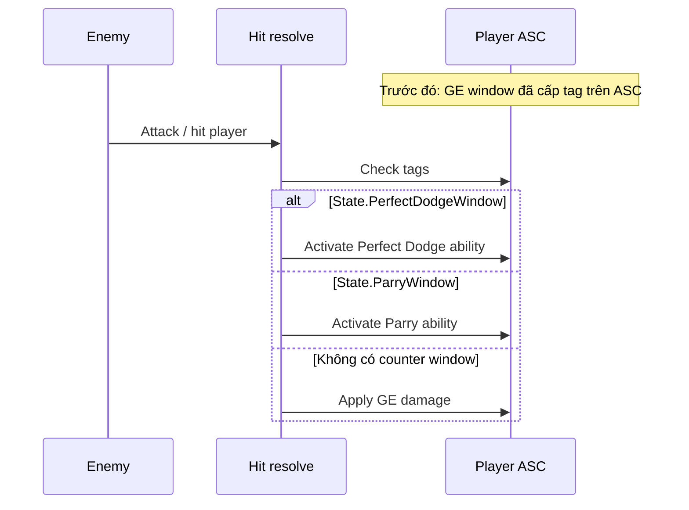

# Tài liệu kỹ thuật — GAS (CombatSystem)

---

## Mục lục
- [Sơ đồ](#sơ-đồ)
- [Tài liệu sản phẩm (Product)](#tài-liệu-sản-phẩm-product)
- [Kiến trúc phần mềm (Logical)](#kiến-trúc-phần-mềm-logical)
- [Kiến trúc triển khai (Physical)](#kiến-trúc-triển-khai-physical)
- [Khái niệm GAS trong dự án](#khái-niệm-gas-trong-dự-án)
  - [Gameplay Attribute](#1-gameplay-attribute)
  - [Gameplay Effect (GE)](#2-gameplay-effect-ge)
  - [Gameplay Effect Execution Calculation](#3-gameplay-effect-execution-calculation)
  - [Gameplay Ability](#4-gameplay-ability)
  - [Gameplay Tag](#5-gameplay-tag)
- [Luồng & sequence](#luồng--sequence)
- [Technical decision log](#technical-decision-log)

---

## Sơ đồ

### Class Diagram

### Game System Diagram

## Tài liệu sản phẩm (Product)

**Yêu cầu nghiệp vụ (tóm tắt):**

- **Player:** combo increases damage; dodge, perfect dodge, parry; can counter when within counter window.
- **Enemy:** receives damage; **Stun** bar — reaches threshold → stunned state / stun lock.
- **Damage:** calculated via GAS (not manual float subtraction); per-hit and combo scaling (per spec design).

**Use case (mức cao):**

| Actor | Hành vi chính |
|-------|----------------|
| Player | Attack → apply GE damage; dodge/parry → GE grants counter window tag. |
| Enemy | Attack → if hits player, check tag on player ASC → activate Perfect Dodge / Parry. |

---

## Kiến trúc phần mềm (Logical)

**Luồng khái niệm:** all combat characters share a **base character** with **ASC** + **Attribute Set**; damage goes through **Gameplay Effect** + **Execution Calculation**; defense uses **GE duration** + **Gameplay Tag** + **Gameplay Ability**.

**Player** và **Enemy** kế thừa cùng base; khác **granted abilities**, AI, input.

---

## Kiến trúc triển khai (Physical)

- **Engine:** Unreal Engine 5, module **Gameplay Abilities** (GAS).
- **Code:** C++ cho base character, attribute set, execution damage; Blueprint cho ability cụ thể, montage, asset GE.
- **Không có database** runtime cho GAS combat — trạng thái nằm trên **ASC** + attribute **replication** khi cần multiplayer.

---

## Khái niệm GAS trong dự án

### 1. Gameplay Attribute

Là **số liệu** (thường float) GAS đọc/ghi. Trong dự án dùng một **Attribute Set** chung, gắn ASC.

| Khái niệm | Vai trò trong thiết kế |
|-----------|------------------------|
| Health / MaxHealth | Nhận damage (HP reduction). |
| Stamina | Tài nguyên cho dodge / skill (GE cost hoặc ability cost). |
| Combo | Combo string — chủ yếu **player**; nhân vào damage (theo spec). |
| BaseDamage | Base damage mỗi hit — đọc từ attacker khi tính damage. |
| Stun | Posture bar — **enemy**; reaches threshold → stun. |

---

### 2. Gameplay Effect (GE)

**Hiệu ứng** instant hoặc theo thời gian lên ASC.

**Trong dự án:**

- **GE damage (instant):** dùng **Execution Calculation** để tính một lần — **không** chồng modifier Health trùng kiểu khác (tránh double damage).
- **GE window (duration):** perfect dodge / parry — **Granted Tag** lên player trong vài giây (counter window).
- GE khác: cost stamina, buff, v.v.

---

### 3. Gameplay Effect Execution Calculation

**Class tính toán** khi GE có **Execution** — dùng cho damage có combo / scale.

**Trong dự án:** đọc **BaseDamage**, **Combo** từ Attribute Set **source**; nhân **Scale** từ **SetByCaller** (tag ví dụ `Data.Damage.Scale`); output trừ **Health** của **target**.

---

### 4. Gameplay Ability

**Hành động** có vòng đời: activate → run → end.

**Trong dự án:** grant lên ASC; kích hoạt từ input, AI, Behavior Tree, hoặc **Gameplay Event**.

---

### 5. Gameplay Tag

**Nhãn** phân cấp (`A.B.C`): Required/Blocked ability, Granted tag từ GE, SetByCaller, Event.

**Trong dự án:**

- `Data.Damage.Scale` — SetByCaller cho per-hit scale.
- `State.PerfectDodgeWindow`, `State.ParryWindow` — counter window.
- `State.Stunned` — enemy (hoặc actor) khi stun threshold reached.

---

## Luồng & sequence

### Damage (bất kỳ hướng player ↔ enemy)

Build **spec** **GE damage** → apply lên ASC **target** → **Execution Calculation** dùng attribute **source** + **SetByCaller (Scale)** → trừ **Health** target.

### Enemy attack → player (Perfect Dodge / Parry)

**Trước hit:** player dodge/parry → **Gameplay Ability** → **GE duration** → Granted Tag: `State.PerfectDodgeWindow` hoặc `State.ParryWindow` trên ASC player.

**Khi resolve hit (enemy → player):**

1. Kiểm tra ASC player có **`State.PerfectDodgeWindow`** → **Try Activate Ability** **Perfect Dodge** (hoặc trigger tương đương).
2. Nếu nhánh parry: kiểm tra **`State.ParryWindow`** → **Try Activate Ability** **Parry** (hoặc ability counter tương ứng).

### Enemy stun

`Stun` tăng khi bị đánh; reaches threshold → stunned state (GE + tag hoặc ability).

### Sơ đồ sequence (mô tả)

---

## Technical decision log

| Quyết định | Lý do ngắn |
|------------|------------|
| Dùng **GAS** | Quản lý ability, buff/debuff, tag, replication thống nhất. |
| Damage qua **Execution Calculation** | Tránh nhân đôi modifier; gom công thức combo + BaseDamage + Scale một chỗ. |
| **BaseDamage** trên attribute, không truyền tay mỗi hit|
| Counter window phòng thủ bằng **GE + Granted Tag** | Dễ kiểm tra trong hit resolve|

---
